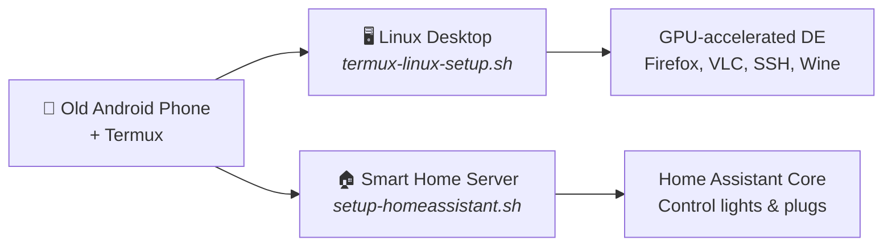

# Repurpose Your Old Android Phone

[](LICENSE)
[](https://termux.dev)
[](https://f-droid.org/en/packages/com.termux/)
[](https://github.com/mayukh4/linux-android/stargazers)

Turn any old Android phone into a **Linux desktop** or a **smart home server** — no PC, no root, no cloud. Just [Termux](https://termux.dev).

> Created to accompany a YouTube video walkthrough. Timestamps are referenced in the video description.



### Pick your path

| | Linux Desktop | Smart Home Server |
|---|---|---|
| **What** | Full GUI desktop environment on your phone | Home Assistant hub that controls WiFi devices |
| **Use cases** | Learning Linux, Python dev, SSH server, web browsing, media | Control smart lights/plugs, automation, dashboards |
| **Script** | `bash termux-linux-setup.sh` | `bash setup-homeassistant.sh` |
| **Time** | 10–30 min | 15–45 min |
| **Jump to** | [Desktop setup](#installation) | [Home Assistant setup](#home-assistant--smart-home-server) |

You can run both on the same phone — they don't conflict.

### Watch the full build

[](https://youtu.be/tYm2rQpkOcg)

**▶ [Repurpose Your Old Android Phone — full walkthrough](https://youtu.be/tYm2rQpkOcg)** — every step in this README, on video, with timestamps in the description.

---

## Requirements

### Hardware
- Android phone with an **arm64 (64-bit)** processor
- **3 GB+ RAM** recommended (4 GB+ for KDE Plasma)
- **5–10 GB** of free storage (more if you install Wine)
- A **Qualcomm Snapdragon** chip is ideal — it enables the best GPU acceleration (Turnip/Adreno). The script works on Mali/other GPUs too but performance will be lighter.

### Software
| App | Where to Get It |
|---|---|
| **Termux** | [F-Droid](https://f-droid.org/en/packages/com.termux/) — **do not use the Play Store version, it is outdated** |
| **Termux-X11** | [GitHub Releases](https://github.com/termux/termux-x11/releases) — download the latest `.apk` |

> **Note on rooting / custom ROMs:** This script works on stock Android too. The video demonstrates it running on **LineageOS** on a OnePlus 5T. Rooting is not required by the script itself.

---

## Desktop Environments — Which One to Choose?

| # | Desktop | Best For | Resource Usage |
|---|---|---|---|
| 1 | **XFCE4** *(default)* | Most users. Fast, customizable, macOS-style dock | Low–Medium |
| 2 | **LXQt** | Old or low-RAM phones (2–3 GB) | Very Low |
| 3 | **MATE** | Classic desktop feel | Medium |
| 4 | **KDE Plasma** | Powerful phones only — Windows 11 style | High |

If you're unsure, go with **XFCE4**.

---

## Installation

### Step 1 — Install required apps

Install **Termux** from F-Droid and **Termux-X11** from GitHub (links above). Grant both apps any permissions they request.

### Step 2 — Pre-upgrade Termux (important — do this first)

Open Termux and run:

```bash
termux-wake-lock
pkg upgrade -y
```

The `termux-wake-lock` command keeps Termux alive when your screen turns off — without it, Android can kill the process mid-install. The `pkg upgrade` brings your base system up to date before the script runs, preventing a known crash involving `libpcre` and `libandroid-selinux`.

### Step 3 — Download and run the script

```bash
curl -O https://raw.githubusercontent.com/mayukh4/linux-android/main/termux-linux-setup.sh
chmod +x termux-linux-setup.sh
bash termux-linux-setup.sh
```

The script will ask you to choose a desktop environment and whether you want Wine. Everything else is automatic.

Installation takes **10–30 minutes** depending on your internet speed. A full log is saved to `~/termux-setup.log` if anything goes wrong.

### Step 4 — Start your desktop

```bash
bash ~/start-linux.sh
```

Then **open the Termux-X11 app** on your phone. Your Linux desktop will appear inside it.

To stop:

```bash
bash ~/stop-linux.sh
```

---

## What Gets Installed

| Component | Details |
|---|---|
| **Termux-X11** | Display server — renders your desktop on screen |
| **Desktop Environment** | Your choice: XFCE4, LXQt, MATE, or KDE |
| **Mesa / Zink** | OpenGL via Vulkan — enables GPU-accelerated graphics |
| **Turnip driver** | Qualcomm Adreno open-source Vulkan driver (if detected) |
| **D-Bus** | Session message bus — required by every desktop's settings daemon |
| **PulseAudio** | Audio server |
| **Firefox** | Full desktop web browser |
| **VLC** | Video and audio player |
| **Git, wget, curl** | Standard developer tools |
| **Python 3 + pip** | Python runtime and package manager |
| **OpenSSH** | SSH server and client — remote access from your PC |
| **Wine** *(optional)* | Run Windows x86 apps via Hangover + Box64 |

---

## GPU Acceleration

The script detects your GPU automatically using hardware properties (not brand name — Samsung ships both Adreno and Mali phones depending on region, so brand detection is unreliable).

**Qualcomm Adreno (Snapdragon phones):** Uses the open-source **Turnip** Vulkan driver + **Zink** (OpenGL on Vulkan). Near-native GPU performance.

**Mali / Other GPUs:** Falls back to **Zink + SwRast** (software Vulkan). Functional but lighter desktops (XFCE4, LXQt) are strongly recommended.

Zink comes from Termux's own `mesa` package (`$PREFIX/lib/dri/zink_dri.so`), which has shipped it since Mesa 23. The script only falls back to the third-party `mesa-zink` build on installs whose Mesa genuinely lacks Zink, or that already have `mesa-zink` from an earlier run — the two stacks ship the same library filenames and cannot be mixed.

The GPU environment is saved in `~/.config/linux-gpu.sh` and loaded automatically on every `start-linux.sh`. You can edit that file to tweak Mesa flags.

Check what the desktop is actually using, from a terminal inside the desktop:

```bash
# Which Vulkan driver did the loader pick?
vulkaninfo --summary | head -30

# Which OpenGL renderer is in use? Should say "zink"
glxinfo -B | grep -i "renderer\|opengl version"
```

---

## SSH — Access Your Phone from a PC or Laptop

OpenSSH is installed automatically by the script. This lets you SSH into your phone from any computer on the same Wi-Fi network — useful for running commands, transferring files, or doing development work on a proper keyboard.

### First-time SSH setup

Open a terminal in Termux (not inside the desktop — the regular Termux app) and run:

```bash
# Start the SSH server
sshd

# Set your Termux password (you'll use this to log in over SSH)
passwd
```

Find your phone's IP address:

```bash
ip addr show wlan0 | grep 'inet '
```

The output will look like `inet 192.168.1.42/24` — your IP is the part before the `/`.

### Connect from your PC or laptop

On your computer (Linux, macOS, or Windows with Terminal):

```bash
ssh your-termux-username@192.168.1.42 -p 8022
```

> **Port 8022** is the default Termux SSH port (not the standard port 22, which requires root).

To find your Termux username, run `whoami` in Termux. On most setups it will be something like `u0_a123`.

### Simplified login with SSH config (optional)

On your PC, add this to `~/.ssh/config` to avoid typing the full command every time:

```
Host myphone
    HostName 192.168.1.42
    User u0_a123
    Port 8022
```

Then you can connect with just:

```bash
ssh myphone
```

### File transfer with SCP or SFTP

Copy a file from your PC to your phone:

```bash
scp -P 8022 myfile.txt u0_a123@192.168.1.42:~/
```

Copy a file from your phone to your PC:

```bash
scp -P 8022 u0_a123@192.168.1.42:~/somefile.txt ./
```

Or use any SFTP client (like FileZilla or Cyberduck) — connect to the same IP and port 8022.

### Keep SSH running when you close Termux

By default `sshd` stops when Termux is closed. To keep it running persistently:

```bash
# Add to your ~/.bashrc so sshd auto-starts whenever Termux opens
echo 'sshd 2>/dev/null' >> ~/.bashrc
```

---

## Windows App Support (Wine)

If you chose to install Wine, it uses **Hangover Wine** with **Box64** to translate Windows x86 calls to ARM64. Simple tools and utilities tend to work; heavy software or games may not.

To configure Wine, run `winecfg` in your desktop terminal or click the Wine Config shortcut on your desktop.

---

## Home Assistant — Smart Home Server

Turn your old Android phone into an **always-on smart home hub** that controls WiFi smart lights, plugs, and other devices — accessible from any browser on your network.

Home Assistant Core runs inside a lightweight Ubuntu container (via proot-distro) on your phone. No root, no cloud dependency for local devices.

### What it can control

| Device Type | Brand Examples | How it connects |
|---|---|---|
| **WiFi smart lights** | TP-Link Kasa, Govee, LIFX | Direct IP on your local network |
| **WiFi smart plugs** | TP-Link Kasa, Wemo | Direct IP on your local network |
| **Cloud-connected devices** | Tuya / Smart Life, Govee | Via cloud API (works everywhere) |
| **Other WiFi devices** | Smart switches, sensors, cameras | By IP or cloud integration |

### Limitations on Android

- **No Bluetooth** — HA cannot access the phone's Bluetooth stack through Termux
- **No USB dongles** — Zigbee/Z-Wave USB sticks won't work without root and kernel support
- **No auto-discovery (mDNS)** — Android 10+ blocks `/proc/net/dev`, which breaks Zeroconf. You must add devices by IP address or cloud API instead of relying on automatic detection
- **No Docker/Add-ons** — This is HA Core, not HA OS. Community add-ons that require Docker won't work. Core integrations (2000+) work fine.

### Installation

```bash
curl -O https://raw.githubusercontent.com/mayukh4/linux-android/main/setup-homeassistant.sh
bash setup-homeassistant.sh
```

Installation takes **15–45 minutes** depending on your phone. The longest step is compiling Home Assistant's Python dependencies (numpy, cryptography, etc.) inside the Ubuntu container.

### Starting and stopping

```bash
# Start Home Assistant
bash ~/start-homeassistant.sh

# Stop Home Assistant
bash ~/stop-homeassistant.sh

# Upgrade to the newest version your container's Python supports
bash ~/upgrade-homeassistant.sh
```

### HACS — the community add-on store

[HACS](https://www.hacs.xyz) is the community store for integrations, themes, and Lovelace cards that aren't in HA core. The setup script offers to install it for you.

> **Install HACS before any other custom integration.** If `custom_components/` already contains hand-installed integrations, remove them first — otherwise HACS can end up in a broken state.

To install it by hand after the fact:

```bash
proot-distro login ubuntu -- sh -c "cd ~/hass-config && wget -O - https://get.hacs.xyz | bash -"
```

Then restart Home Assistant and finish setup in the dashboard:

1. **Settings → Devices & Services → + Add Integration**
2. Search for **HACS**
3. Tick all the acknowledgements, then authorize with your GitHub account

Full configuration docs: [hacs.xyz/docs/use/configuration/basic](https://www.hacs.xyz/docs/use/configuration/basic/).

### Upgrading Home Assistant

```bash
bash ~/upgrade-homeassistant.sh
```

**Why a fresh install may land on an older version than the HA website shows.** `pip` installs the newest release whose `requires-python` your interpreter satisfies, then stops. It is not a failed install:

| Container Python | Newest Home Assistant you can run |
|---|---|
| 3.12 | 2025.1.x |
| 3.13.0 – 3.13.1 | 2025.5.x |
| 3.13.2+ | **2026.2.x** |
| 3.14.2+ | 2026.3 and later |

(Verified against each release's `requires-python` on PyPI.)

`proot-distro install ubuntu` tracks a rolling Ubuntu release, so which Python you get depends on when you installed the container. `bash ~/upgrade-homeassistant.sh` prints your Python version and tells you if you have hit the ceiling.

<details>
<summary>Advanced: get past the ceiling with a newer Python</summary>

This is not automated because it replaces the interpreter under a working install. Back up `~/hass-config` first.

```bash
proot-distro login ubuntu

# 1. Fetch a standalone CPython 3.14 (no PPA, no compiling)
curl -LsSf https://astral.sh/uv/install.sh | sh
export PATH="$HOME/.local/bin:$PATH"
uv python install 3.14

# 2. Build a fresh venv on it, leaving the old one in place
uv venv --python 3.14 ~/hass-venv-314
~/hass-venv-314/bin/python -m pip install --upgrade pip wheel setuptools
uv pip install --python ~/hass-venv-314/bin/python homeassistant

# 3. Test it against your existing config before switching over
~/hass-venv-314/bin/hass -c ~/hass-config
```

If it starts cleanly, point `~/start-homeassistant.sh` at `hass-venv-314/bin/hass`. If not, your old `~/hass-venv` is untouched — just keep using it.

Note that Home Assistant Core (the Python/venv install method) was [deprecated upstream in 2025](https://www.home-assistant.io/blog/2025/05/22/deprecating-core-and-supervised-installation-methods-and-32-bit-systems/). It still works and still gets releases; it just is not an officially supported install method any more. On a phone it remains the only realistic option — HA OS and HA Container both need Docker or bare metal.
</details>

### Accessing the dashboard

Once HA is running, open a browser on **any device on your WiFi network** and go to:

```
http://<your-phone-ip>:8123
```

Find your phone's IP with `ip addr show wlan0 | grep 'inet '` in Termux.

The first launch takes **5–10 minutes** to initialize. You'll create your admin account in the browser on first visit.

### Adding your first device — TP-Link Kasa

1. Open the Kasa app on your regular phone and note the device's IP address (Device Settings → Device Info)
2. In HA dashboard: **Settings → Devices & Services → + Add Integration**
3. Search for **"TP-Link Kasa Smart"**
4. Enter the device IP address when prompted
5. Your light/plug should appear — you can now control it from the HA dashboard

> Since mDNS is disabled on Android, auto-discovery won't find devices. Always add by IP.

### Adding Tuya / Smart Life devices

Tuya devices connect through the Tuya cloud API, which works regardless of local network restrictions:

1. Go to [iot.tuya.com](https://iot.tuya.com) and create a free developer account
2. Create a **Cloud Project** → select your data center region → add the **Smart Home** API
3. Go to **Devices** → **Link Tuya App Account** → scan the QR code with the Smart Life / Tuya Smart app
4. In HA dashboard: **Settings → Devices & Services → + Add Integration → Tuya**
5. Enter your **Access ID** and **Access Secret** from the Tuya IoT console

### Keeping Home Assistant running in the background

By default, Android kills Termux processes when the app is backgrounded. To keep HA running 24/7:

```bash
# Option 1: Run in background with nohup
termux-wake-lock
nohup bash ~/start-homeassistant.sh > ~/hass.log 2>&1 &

# Option 2: Auto-start on Termux launch (add to ~/.bashrc)
echo 'termux-wake-lock && nohup bash ~/start-homeassistant.sh > ~/hass.log 2>&1 &' >> ~/.bashrc
```

`termux-wake-lock` prevents Android from suspending the process. Plug your phone into a charger and it becomes a dedicated always-on server.

---

## Video Use Cases

Ideas for what you can do with your old Android phone running this setup:

- **Smart home controller** — plug it in, run Home Assistant 24/7, control your lights and plugs from any device on your network
- **Linux desktop for learning** — a full XFCE4/KDE/MATE desktop to learn Linux without buying a PC
- **SSH development server** — code on your laptop, run on your phone over SSH
- **Python development workstation** — Python 3 + pip ready to go, great for learning or small projects
- **Media server / file server** — serve files over your local network using Python's built-in HTTP server or install Samba
- **Network monitoring dashboard** — access Home Assistant and system stats from any browser

---

## Troubleshooting

**Script exits mid-install without a clear error**
Check `~/termux-setup.log`. The script logs every package install result. The last line will tell you exactly which package triggered the failure.

**Desktop doesn't appear after running start-linux.sh**
Open the Termux-X11 app manually — the desktop renders inside that app, not in the Termux terminal itself.

**Black screen in Termux-X11**
Run `stop-linux.sh` then `start-linux.sh` again. KDE Plasma can take 20–30 seconds longer than other DEs on first boot.

**"library not found" or "cannot link executable" error during install**
This is the libpcre crash. Close Termux completely, reopen it, run `pkg upgrade -y`, then re-run the script.

**"Unable to contact settings server" / "Failed to connect to socket .../dbus-XXXX: Connection refused"**
The desktop's settings daemon talks over the D-Bus session bus. Either no bus is running, or a previous session was force-killed and left a dead socket behind that the desktop keeps trying to reuse. `start-linux.sh` now clears the stale state and starts a bus at a fixed address before launching the desktop. If you are on an older copy of the script, re-run `termux-linux-setup.sh` to regenerate the launchers, or fix it by hand:

```bash
pkg install dbus
pkill -9 -f dbus-daemon
rm -rf ~/.dbus "$PREFIX"/tmp/dbus-*
mkdir -p "$PREFIX/var/run/dbus"
export DBUS_SESSION_BUS_ADDRESS="unix:path=$PREFIX/var/run/dbus/session_bus_socket"
dbus-daemon --session --address="$DBUS_SESSION_BUS_ADDRESS" --nopidfile --fork
```

**Vulkan / Mesa packages fail: "vulkan-loader-generic : Conflicts: vulkan-loader-android", or dpkg "trying to overwrite libvulkan_freedreno.so"**
Two separate causes, both fixed in the current script:

- `vulkan-loader-generic` both *provides* and *conflicts with* `vulkan-loader-android`, so asking for the android loader on a normal install aborts the whole transaction for no benefit. The script now installs `vulkan-loader-generic`.
- The third-party `mesa-zink-vulkan-icd-freedreno` (Mesa 22) ships the same `libvulkan_freedreno.so` as the main-repo Turnip driver (Mesa 26), so installing both makes dpkg abort. The script now picks one stack and stays on it.

If your install predates this fix, GPU acceleration probably still worked — those two failures are loud but not fatal. Re-running the script cleans it up.

**Package install fails with "unmet dependencies" or "Conflicts"**
The script's `safe_install_pkg` function reads each package's declared conflicts, evaluates version constraints properly, and lets apt perform conflicts the package legitimately replaces. If you still see this, check the log and open a GitHub issue with your device model and Android version.

**Audio not working**
Wait 5–10 seconds after the desktop appears. PulseAudio needs a moment to initialize on first start.

**SSH connection refused**
Make sure `sshd` is running (`ps aux | grep sshd`). If not, run `sshd` again. Confirm you're using port 8022, not 22.

**Wine doesn't launch**
Wine needs an active display. Make sure your desktop is running first, then run `winecfg` from the terminal inside the desktop.

**Home Assistant: "pip install homeassistant" fails with compilation errors**
This usually means a build dependency is missing. Run `proot-distro login ubuntu` and check that `python3-dev`, `libffi-dev`, `libssl-dev`, and `cargo` are installed. Then retry: `source ~/hass-venv/bin/activate && pip install homeassistant`.

**Home Assistant: dashboard not loading at port 8123**
First launch takes 5–10 minutes. Check if HA is still initializing: `proot-distro login ubuntu -- bash -c "source ~/hass-venv/bin/activate && hass -c ~/hass-config"` and watch the output. Make sure your phone and browser are on the same WiFi network.

**Home Assistant: "address already in use" error on startup**
Another HA instance is already running. Stop it first with `bash ~/stop-homeassistant.sh`, or manually: `pkill -f "hass -c"`.

**Home Assistant: devices not discovered automatically**
This is expected on Android. The `/proc/net/dev` restriction on Android 10+ prevents mDNS/Zeroconf from working. Add devices manually by IP address or use cloud-based integrations (Tuya, Govee Cloud, etc.).

---

## Advanced Notes

<details>
<summary>Customize GPU flags</summary>

`~/.config/linux-gpu.sh` is sourced on every desktop start. Common tweaks:

```bash
# Force software rendering (for debugging)
export GALLIUM_DRIVER=llvmpipe

# Enable Mesa debug output
export MESA_DEBUG=1

# Change OpenGL version override
export MESA_GL_VERSION_OVERRIDE=3.3
```
</details>

<details>
<summary>SSH key authentication (passwordless login)</summary>

On your PC, generate a key pair if you don't have one:

```bash
ssh-keygen -t ed25519
```

Copy your public key to your phone:

```bash
ssh-copy-id -p 8022 u0_a123@192.168.1.42
```

After this, SSH will no longer ask for a password.
</details>

<details>
<summary>Auto-start desktop when Termux opens</summary>

Add to `~/.bashrc` in Termux:

```bash
# Uncomment to auto-launch desktop on Termux open
# bash ~/start-linux.sh
```
</details>

<details>
<summary>How the conflict-safe installer works</summary>

Termux has several packages that hard-conflict with each other (for example `vulkan-loader-android` and `vulkan-loader-generic` declare a mutual `Conflicts`). Standard `apt-get` fails loudly when you install one while the other is present, which would exit the script mid-run.

`safe_install_pkg` reads each package's metadata from `apt-cache show` before installing and decides what to do:

1. **Already installed, or already provided.** `vulkan-loader-generic` *provides* `vulkan-loader-android`, so asking for the latter is already satisfied — no install needed.
2. **Version constraints are honoured.** `Conflicts: ndk-sysroot (<< 23b-6)` only applies below `23b-6`, evaluated with `dpkg --compare-versions`. Treating that as an unconditional conflict used to skip packages that would have installed fine.
3. **Replacements are allowed through.** A package that declares `Replaces:`/`Provides:` the thing it conflicts with is a supported swap, and apt handles it.
4. **Genuine conflicts are skipped** with a warning, and the script continues.

The result: the script is safe to run on any Termux setup regardless of what was pre-installed, without silently skipping things it should have installed.
</details>

<details>
<summary>About the Termux path</summary>

All hardcoded `/data/data/com.termux/...` paths have been replaced with `$PREFIX` (the standard Termux environment variable). This means the script works on non-standard installs such as Termux on a secondary Android user profile.
</details>

---

## Contributing

PRs and issues are welcome. If a package name has changed, a DE has a better startup command, or you've found a new conflict to handle, open an issue with your device model and Android version.

---

## Read this in other languages

If you would prefer to read this in Chinese, the full translation is here: **[中文文档 / Chinese documentation](README.zh.md)**.

Translations of the README into other languages are welcome — open a PR with a `README.<lang>.md` file and I will link it here.

---

## Support this project

If this saved you buying a Raspberry Pi, you can [sponsor the work on GitHub](https://github.com/sponsors/mayukh4). Starring the repo helps too — it is what gets it in front of the next person looking to do this.

---

## License

MIT — use and modify freely.
