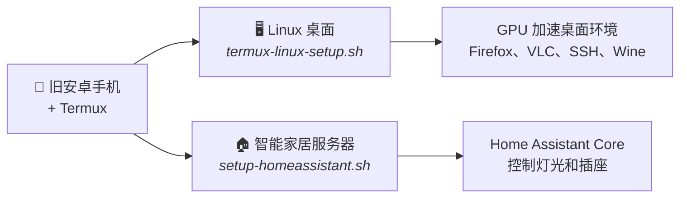

# 旧安卓手机再利用

**[English](README.md)**

> 本翻译可能落后于英文 README。以 [README.md](README.md) 为准。

将任意旧安卓手机变成 **Linux 桌面**或**智能家居服务器** — 无需电脑、无需 Root、无需云服务，只需 [Termux](https://termux.dev)。

> 本项目配合 YouTube 视频教程制作，视频描述中附有时间戳索引。



### 选择你的方案

| | Linux 桌面 | 智能家居服务器 |
|---|---|---|
| **是什么** | 手机上的完整 GUI 桌面环境 | 控制 WiFi 设备的 Home Assistant 中心 |
| **使用场景** | 学习 Linux、Python 开发、SSH 服务器、网页浏览、媒体播放 | 控制智能灯/插座、自动化、仪表盘 |
| **脚本** | `bash termux-linux-setup.sh` | `bash setup-homeassistant.sh` |
| **耗时** | 10–30 分钟 | 15–45 分钟 |
| **跳转** | [桌面安装](#安装) | [Home Assistant 安装](#home-assistant--智能家居服务器) |

两者可以在同一部手机上运行 — 互不冲突。

### 观看完整教程

[](https://youtu.be/tYm2rQpkOcg)

**▶ [旧安卓手机再利用 — 完整视频教程](https://youtu.be/tYm2rQpkOcg)** — 本文档的每一步都有视频演示，视频描述中附有时间戳。

---

## 系统要求

### 硬件
- 搭载 **arm64（64 位）** 处理器的安卓手机
- 推荐 **3 GB 以上内存**（KDE Plasma 需 4 GB 以上）
- **5–10 GB** 可用存储空间（安装 Wine 需要更多）
- **高通骁龙**芯片最佳 — 可获得最好的 GPU 加速效果（Turnip/Adreno）。脚本也支持 Mali 及其他 GPU，但性能较弱。

### 软件
| 应用 | 获取方式 |
|---|---|
| **Termux** | [F-Droid](https://f-droid.org/en/packages/com.termux/) — **请勿使用 Play Store 版本，该版本已过时** |
| **Termux-X11** | [GitHub Releases](https://github.com/termux/termux-x11/releases) — 下载最新 `.apk` |

> **关于 Root / 自定义 ROM 的说明：** 本脚本在原版安卓上即可运行。视频演示使用的是 **LineageOS** 系统的一加 5T。脚本本身不需要 Root。

---

## 桌面环境 — 如何选择？

| # | 桌面环境 | 适合人群 | 资源占用 |
|---|---|---|---|
| 1 | **XFCE4** *（默认）* | 大多数用户。快速、可定制、macOS 风格 Dock | 低–中 |
| 2 | **LXQt** | 旧手机或低内存设备（2–3 GB） | 极低 |
| 3 | **MATE** | 经典桌面体验 | 中等 |
| 4 | **KDE Plasma** | 仅适合高性能手机 — Windows 11 风格 | 高 |

如果不确定，选择 **XFCE4**。

---

## 安装

### 步骤 1 — 安装必要应用

从 F-Droid 安装 **Termux**，从 GitHub 安装 **Termux-X11**（链接见上方）。授予两个应用所需的所有权限。

### 步骤 2 — 预升级 Termux（重要 — 请先执行此步）

打开 Termux 并运行：

```bash
termux-wake-lock
pkg upgrade -y
```

`termux-wake-lock` 命令可保持 Termux 在屏幕关闭时继续运行 — 没有它，安卓可能会在安装过程中杀死进程。`pkg upgrade` 会在脚本运行前更新基础系统，避免 `libpcre` 和 `libandroid-selinux` 相关的已知崩溃问题。

### 步骤 3 — 下载并运行脚本

```bash
curl -O https://raw.githubusercontent.com/mayukh4/linux-android/main/termux-linux-setup.sh
chmod +x termux-linux-setup.sh
bash termux-linux-setup.sh
```

脚本会询问你选择哪个桌面环境以及是否安装 Wine，其余全部自动完成。

安装耗时 **10–30 分钟**，取决于网络速度。完整的日志保存在 `~/termux-setup.log` 中，方便排查问题。

### 步骤 4 — 启动桌面

```bash
bash ~/start-linux.sh
```

然后在手机上**打开 Termux-X11 应用**，Linux 桌面将显示在其中。

停止桌面：

```bash
bash ~/stop-linux.sh
```

---

## 安装内容一览

| 组件 | 说明 |
|---|---|
| **Termux-X11** | 显示服务器 — 在屏幕上渲染桌面 |
| **桌面环境** | 你的选择：XFCE4、LXQt、MATE 或 KDE |
| **Mesa / Zink** | 通过 Vulkan 实现 OpenGL — 启用 GPU 加速图形渲染 |
| **Turnip 驱动** | 高通 Adreno 开源 Vulkan 驱动（如检测到） |
| **PulseAudio** | 音频服务器 |
| **Firefox** | 完整桌面浏览器 |
| **VLC** | 视频和音频播放器 |
| **Git、wget、curl** | 常用开发工具 |
| **Python 3 + pip** | Python 运行时和包管理器 |
| **OpenSSH** | SSH 服务器和客户端 — 从电脑远程访问 |
| **Wine** *（可选）* | 通过 Hangover + Box64 运行 Windows x86 应用 |

---

## GPU 加速

脚本通过硬件属性自动检测 GPU（而非品牌名称 — 三星根据地区不同会同时使用 Adreno 和 Mali，因此品牌检测不可靠）。

**高通 Adreno（骁龙手机）：** 使用开源 **Turnip** Vulkan 驱动 + **Zink**（Vulkan 上的 OpenGL）。接近原生 GPU 性能。

**Mali / 其他 GPU：** 回退到 **Zink + SwRast**（软件 Vulkan）。功能可用，但强烈建议使用轻量级桌面（XFCE4、LXQt）。

GPU 环境配置保存在 `~/.config/linux-gpu.sh` 中，每次运行 `start-linux.sh` 时自动加载。你可以编辑该文件来调整 Mesa 参数。

---

## SSH — 从电脑访问手机

脚本会自动安装 OpenSSH。你可以从同一 WiFi 网络中的任何电脑 SSH 到手机 — 适合执行命令、传输文件或在正式键盘上进行开发。

### 首次 SSH 设置

在 Termux 中打开终端（不是桌面内的终端，而是 Termux 应用本身），运行：

```bash
# 启动 SSH 服务器
sshd

# 设置 Termux 密码（SSH 登录时使用）
passwd
```

查看手机 IP 地址：

```bash
ip addr show wlan0 | grep 'inet '
```

输出类似 `inet 192.168.1.42/24` — IP 地址是 `/` 前面的部分。

### 从电脑连接

在你的电脑上（Linux、macOS 或 Windows 终端）：

```bash
ssh 你的termux用户名@192.168.1.42 -p 8022
```

> **端口 8022** 是 Termux SSH 的默认端口（不是标准的 22 端口，后者需要 Root 权限）。

在 Termux 中运行 `whoami` 查看你的用户名，通常是类似 `u0_a123` 的格式。

### 使用 SSH 配置简化登录（可选）

在电脑上将以下内容添加到 `~/.ssh/config`，无需每次输入完整命令：

```
Host myphone
    HostName 192.168.1.42
    User u0_a123
    Port 8022
```

之后只需输入：

```bash
ssh myphone
```

### 使用 SCP 或 SFTP 传输文件

从电脑复制文件到手机：

```bash
scp -P 8022 myfile.txt u0_a123@192.168.1.42:~/
```

从手机复制文件到电脑：

```bash
scp -P 8022 u0_a123@192.168.1.42:~/somefile.txt ./
```

也可以使用任何 SFTP 客户端（如 FileZilla 或 Cyberduck）— 连接到相同 IP 和端口 8022。

### 关闭 Termux 后保持 SSH 运行

默认情况下 `sshd` 会在 Termux 关闭时停止。要保持持久运行：

```bash
# 添加到 ~/.bashrc，使 sshd 在 Termux 打开时自动启动
echo 'sshd 2>/dev/null' >> ~/.bashrc
```

---

## Windows 应用支持（Wine）

如果你选择安装 Wine，它使用 **Hangover Wine** 配合 **Box64** 将 Windows x86 调用转换为 ARM64。简单工具和实用程序通常可以运行；大型软件或游戏可能无法正常工作。

要配置 Wine，在桌面终端中运行 `winecfg` 或点击桌面上的 Wine Config 快捷方式。

---

## Home Assistant — 智能家居服务器

将旧安卓手机变成**全天候智能家居中心**，控制 WiFi 智能灯、插座和其他设备 — 可从网络中的任何浏览器访问。

Home Assistant Core 运行在手机上的轻量级 Ubuntu 容器中（通过 proot-distro），无需 Root，本地设备无需云服务。

### 可控制的设备

| 设备类型 | 品牌示例 | 连接方式 |
|---|---|---|
| **WiFi 智能灯** | TP-Link Kasa、Govee、LIFX | 通过本地网络直连 IP |
| **WiFi 智能插座** | TP-Link Kasa、Wemo | 通过本地网络直连 IP |
| **云连接设备** | Tuya / Smart Life、Govee | 通过云 API（随处可用） |
| **其他 WiFi 设备** | 智能开关、传感器、摄像头 | 通过 IP 或云集成 |

### 安卓上的限制

- **不支持蓝牙** — HA 无法通过 Termux 访问手机的蓝牙协议栈
- **不支持 USB 适配器** — Zigbee/Z-Wave USB 设备需要 Root 和内核支持才能使用
- **不支持自动发现（mDNS）** — Android 10+ 阻止了 `/proc/net/dev` 的访问，导致 Zeroconf 无法工作。必须通过 IP 地址或云 API 添加设备，不能依赖自动发现
- **不支持 Docker/插件** — 这是 HA Core，不是 HA OS。需要 Docker 的社区插件无法运行。核心集成（2000+）均可正常使用。

### 安装

```bash
curl -O https://raw.githubusercontent.com/mayukh4/linux-android/main/setup-homeassistant.sh
bash setup-homeassistant.sh
```

安装耗时 **15–45 分钟**，取决于手机性能。最耗时的步骤是在 Ubuntu 容器中编译 Home Assistant 的 Python 依赖（numpy、cryptography 等）。

### 启动和停止

```bash
# 启动 Home Assistant
bash ~/start-homeassistant.sh

# 停止 Home Assistant
bash ~/stop-homeassistant.sh

# 升级到当前容器 Python 所能支持的最新版本
bash ~/upgrade-homeassistant.sh
```

### HACS — 社区插件商店

[HACS](https://www.hacs.xyz) 是社区集成、主题和 Lovelace 卡片的商店，收录了 HA 核心之外的内容。安装脚本会询问是否为你安装。

> **请在安装任何其他自定义集成之前先安装 HACS。** 如果 `custom_components/` 中已有手动安装的集成，请先删除它们，否则 HACS 可能会处于损坏状态。

事后手动安装：

```bash
proot-distro login ubuntu -- sh -c "cd ~/hass-config && wget -O - https://get.hacs.xyz | bash -"
```

然后重启 Home Assistant，并在仪表盘中完成设置：

1. **设置 → 设备与服务 → + 添加集成**
2. 搜索 **HACS**
3. 勾选所有确认项，然后使用 GitHub 账号授权

完整配置文档：[hacs.xyz/docs/use/configuration/basic](https://www.hacs.xyz/docs/use/configuration/basic/)。

### 升级 Home Assistant

```bash
bash ~/upgrade-homeassistant.sh
```

**为什么全新安装得到的版本比 HA 官网显示的旧。** `pip` 只会安装解释器所满足 `requires-python` 的最新版本，然后就停下来。这不是安装失败：

| 容器 Python | 可运行的最新 Home Assistant |
|---|---|
| 3.12 | 2025.1.x |
| 3.13.0 – 3.13.1 | 2025.5.x |
| 3.13.2+ | **2026.2.x** |
| 3.14.2+ | 2026.3 及以后 |

（依据 PyPI 上各版本的 `requires-python` 核实。）

`proot-distro install ubuntu` 跟随 Ubuntu 滚动发行版，所以你拿到哪个 Python 取决于安装容器的时间。`bash ~/upgrade-homeassistant.sh` 会打印你的 Python 版本，并在触及上限时告诉你。

> 想突破这个上限（改用 Python 3.14）请参见[英文文档的 Upgrading Home Assistant 一节](README.md#upgrading-home-assistant)。该操作会替换正在运行的安装所用的解释器，因此没有自动化。

### 访问仪表盘

HA 运行后，在**同一 WiFi 网络中的任何设备**的浏览器中访问：

```
http://<你的手机IP>:8123
```

在 Termux 中运行 `ip addr show wlan0 | grep 'inet '` 查看手机 IP。

首次启动需要 **5–10 分钟** 进行初始化。首次访问时你需要在浏览器中创建管理员账户。

### 添加第一个设备 — TP-Link Kasa

1. 在常用手机上打开 Kasa 应用，记下设备的 IP 地址（设备设置 → 设备信息）
2. 在 HA 仪表盘中：**设置 → 设备与服务 → + 添加集成**
3. 搜索 **"TP-Link Kasa Smart"**
4. 按提示输入设备 IP 地址
5. 你的灯/插座应该会出现 — 现在可以从 HA 仪表盘控制它了

> 由于安卓上 mDNS 被禁用，自动发现无法找到设备。请始终通过 IP 手动添加。

### 添加 Tuya / Smart Life 设备

Tuya 设备通过 Tuya 云 API 连接，不受本地网络限制影响：

1. 前往 [iot.tuya.com](https://iot.tuya.com) 创建免费开发者账户
2. 创建**云项目** → 选择你的数据中心区域 → 添加**智能家居** API
3. 进入**设备** → **关联涂鸦 App 账号** → 使用 Smart Life / Tuya Smart 应用扫描二维码
4. 在 HA 仪表盘中：**设置 → 设备与服务 → + 添加集成 → Tuya**
5. 输入 Tuya IoT 控制台中的 **Access ID** 和 **Access Secret**

### 保持 Home Assistant 后台运行

默认情况下，安卓会在 Termux 切到后台时杀死其进程。要保持 HA 24/7 运行：

```bash
# 方式 1：使用 nohup 后台运行
termux-wake-lock
nohup bash ~/start-homeassistant.sh > ~/hass.log 2>&1 &

# 方式 2：Termux 启动时自动运行（添加到 ~/.bashrc）
echo 'termux-wake-lock && nohup bash ~/start-homeassistant.sh > ~/hass.log 2>&1 &' >> ~/.bashrc
```

`termux-wake-lock` 可防止安卓挂起进程。将手机接上充电器，它就变成了一台专用常驻服务器。

---

## 视频使用场景

旧安卓手机运行此方案后的用途灵感：

- **智能家居控制器** — 插上电源，24/7 运行 Home Assistant，从网络中的任何设备控制灯光和插座
- **学习用 Linux 桌面** — 完整的 XFCE4/KDE/MATE 桌面，无需购买电脑即可学习 Linux
- **SSH 开发服务器** — 在笔记本上编码，通过 SSH 在手机上运行
- **Python 开发工作站** — Python 3 + pip 开箱即用，适合学习或小型项目
- **媒体服务器 / 文件服务器** — 使用 Python 内置 HTTP 服务器或安装 Samba 在本地网络上共享文件
- **网络监控仪表盘** — 从任何浏览器访问 Home Assistant 和系统状态

---

## 故障排除

**脚本安装中途退出且无明确错误**
查看 `~/termux-setup.log`。脚本会记录每个包的安装结果，最后一行会告诉你具体是哪个包导致了失败。

**运行 start-linux.sh 后桌面不显示**
手动打开 Termux-X11 应用 — 桌面在该应用内渲染，而不是在 Termux 终端中。

**Termux-X11 中黑屏**
运行 `stop-linux.sh` 然后重新运行 `start-linux.sh`。KDE Plasma 首次启动比其他桌面环境多需要 20–30 秒。

**安装时出现"library not found"或"cannot link executable"错误**
这是 libpcre 崩溃问题。完全关闭 Termux，重新打开，运行 `pkg upgrade -y`，然后重新运行脚本。

**出现"Unable to contact settings server"或"Failed to connect to socket .../dbus-XXXX: Connection refused"**
桌面的设置守护进程通过 D-Bus 会话总线通信。要么总线没有启动，要么上一次会话被强制杀死后留下了失效的 socket，而桌面仍在尝试复用它。现在 `start-linux.sh` 会先清理残留状态，再在固定地址上启动总线，然后才启动桌面。如果你用的是旧版脚本，重新运行 `termux-linux-setup.sh` 以重新生成启动脚本，或手动修复：

```bash
pkg install dbus
pkill -9 -f dbus-daemon
rm -rf ~/.dbus "$PREFIX"/tmp/dbus-*
mkdir -p "$PREFIX/var/run/dbus"
export DBUS_SESSION_BUS_ADDRESS="unix:path=$PREFIX/var/run/dbus/session_bus_socket"
dbus-daemon --session --address="$DBUS_SESSION_BUS_ADDRESS" --nopidfile --fork
```

**Vulkan / Mesa 包安装失败：提示"vulkan-loader-generic : Conflicts: vulkan-loader-android"，或 dpkg 报"trying to overwrite libvulkan_freedreno.so"**
这是两个独立的原因，现在都已修复：

- `vulkan-loader-generic` 同时 *provides* 和 *conflicts* `vulkan-loader-android`，因此在正常安装环境下请求 android 版本会让整个事务失败，且毫无收益。脚本现在直接安装 `vulkan-loader-generic`。
- 第三方的 `mesa-zink-vulkan-icd-freedreno`（Mesa 22）与主仓库的 Turnip 驱动（Mesa 26）打包了同名的 `libvulkan_freedreno.so`，同时安装会让 dpkg 中止。脚本现在只选择其中一套并始终保持一致。

如果你的安装早于此修复，GPU 加速大概率仍然可用 — 这两个报错声势很大但并不致命。重新运行脚本即可清理。

**包安装失败，提示"unmet dependencies"或"Conflicts"**
脚本的 `safe_install_pkg` 函数会读取每个包声明的冲突，正确处理版本约束，并允许 apt 执行该包合法替换（Replaces）的冲突。如果仍然出现此问题，请查看日志并提交 GitHub Issue，附上你的设备型号和安卓版本。

**音频不工作**
桌面出现后等待 5–10 秒。PulseAudio 首次启动需要一点时间来初始化。

**SSH 连接被拒绝**
确保 `sshd` 正在运行（`ps aux | grep sshd`）。如果未运行，重新执行 `sshd`。确认使用的是端口 8022，而非 22。

**Wine 无法启动**
Wine 需要活跃的显示环境。确保桌面已运行，然后在桌面内的终端中运行 `winecfg`。

**Home Assistant："pip install homeassistant"编译错误**
通常表示缺少构建依赖。运行 `proot-distro login ubuntu` 并确认已安装 `python3-dev`、`libffi-dev`、`libssl-dev` 和 `cargo`。然后重试：`source ~/hass-venv/bin/activate && pip install homeassistant`。

**Home Assistant：8123 端口仪表盘无法加载**
首次启动需要 5–10 分钟。检查 HA 是否仍在初始化：`proot-distro login ubuntu -- bash -c "source ~/hass-venv/bin/activate && hass -c ~/hass-config"` 并查看输出。确保手机和浏览器在同一 WiFi 网络中。

**Home Assistant：启动时出现"address already in use"错误**
已有 HA 实例在运行。先停止它：`bash ~/stop-homeassistant.sh`，或手动停止：`pkill -f "hass -c"`。

**Home Assistant：设备无法自动发现**
这在安卓上是正常现象。Android 10+ 对 `/proc/net/dev` 的限制导致 mDNS/Zeroconf 无法工作。请通过 IP 地址手动添加设备，或使用云端集成（Tuya、Govee Cloud 等）。

---

## 进阶说明

<details>
<summary>自定义 GPU 参数</summary>

`~/.config/linux-gpu.sh` 在每次桌面启动时被加载。常用调整：

```bash
# 强制软件渲染（用于调试）
export GALLIUM_DRIVER=llvmpipe

# 启用 Mesa 调试输出
export MESA_DEBUG=1

# 修改 OpenGL 版本覆盖
export MESA_GL_VERSION_OVERRIDE=3.3
```
</details>

<details>
<summary>SSH 密钥认证（免密登录）</summary>

在电脑上生成密钥对（如果还没有）：

```bash
ssh-keygen -t ed25519
```

将公钥复制到手机：

```bash
ssh-copy-id -p 8022 u0_a123@192.168.1.42
```

之后 SSH 将不再要求输入密码。
</details>

<details>
<summary>Termux 打开时自动启动桌面</summary>

在 Termux 的 `~/.bashrc` 中添加：

```bash
# 取消注释以在 Termux 打开时自动启动桌面
# bash ~/start-linux.sh
```
</details>

<details>
<summary>冲突安全安装器的工作原理</summary>

Termux 中有几个包会互相硬冲突（例如 `vulkan-loader-android` 和 `vulkan-loader-generic` 声明了互斥的 `Conflicts`）。标准的 `apt-get` 在安装一个包时如果另一个已存在会直接报错，导致脚本退出。

`safe_install_pkg` 函数通过在每次安装前从 `apt-cache show` 读取 `Conflicts` 字段来解决这个问题。如果声明的冲突包已安装，则跳过该包并发出警告，脚本继续运行。这意味着无论系统中预装了什么包，脚本都可以安全运行。
</details>

<details>
<summary>关于 Termux 路径</summary>

所有硬编码的 `/data/data/com.termux/...` 路径都已替换为 `$PREFIX`（Termux 标准环境变量）。这意味着脚本也适用于非标准安装，例如安卓次要用户配置文件中的 Termux。
</details>

---

## 贡献

欢迎提交 PR 和 Issue。如果包名已更改、某个桌面环境有更好的启动命令，或者你发现了新的冲突需要处理，请提交 Issue 并附上设备型号和安卓版本。

---

## 其他语言

英文原版文档在这里：**[English documentation](README.md)**（内容以英文版为准）。

---

## 支持本项目

如果本项目帮你省下了买树莓派的钱，欢迎[在 GitHub 上赞助](https://github.com/sponsors/mayukh4)。给仓库点个 Star 也很有帮助 — 这能让更多有同样需求的人看到它。

---

## 许可证

MIT — 可自由使用和修改。
